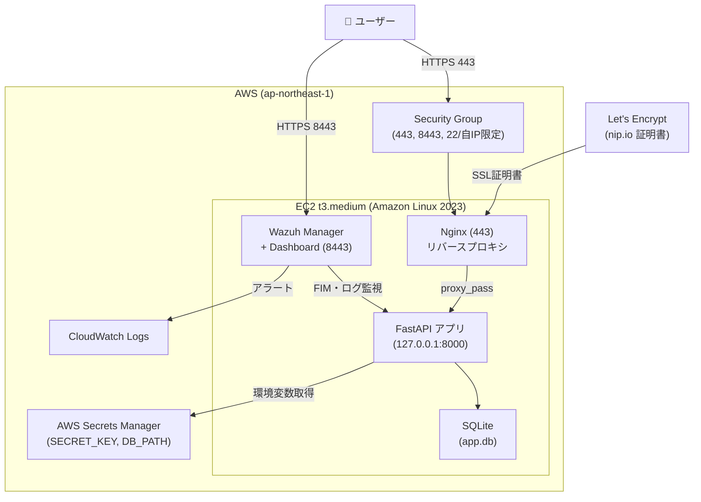

# 証明書・ライセンス管理ダッシュボード

SSL証明書とライセンスの期限管理を行うWebアプリを構築し、  
**HIDS監視・セキュリティ設計・運用自動化**を実装したプロジェクトです。


---

## アーキテクチャ



---

## セキュリティ設計

### ネットワーク層
| 対策 | 実装内容 |
|---|---|
| **Security Group** | SSH は自IP限定、アプリポート(443/8443)のみ公開 |
| **HTTPS 強制** | Let's Encrypt + Nginx でTLS終端。HTTP→HTTPS リダイレクト |
| **Nginx リバースプロキシ** | アプリを 127.0.0.1 にバインドし直接アクセスを遮断 |

### アプリケーション層
| 対策 | 実装内容 |
|---|---|
| **認証** | セッション Cookie（itsdangerous 署名）+ bcrypt ハッシュ |
| **シークレット管理** | `SECRET_KEY` を AWS Secrets Manager で管理。コードに秘密情報なし |
| **IAM 最小権限** | EC2インスタンスプロファイルに Secrets Manager GetSecretValue のみ付与 |

### ホスト層（Wazuh HIDS）
| 機能 | 設定内容 | MITRE ATT&CK |
|---|---|---|
| **FIM（変更監視）** | `/etc`, `/opt/app` をリアルタイム監視 | T1070.004, T1485 |
| **rootcheck** | ホスト異常・不審プロセスを自動検知 | T1543 |
| **ポート監視** | 新規ポート開放を即時検知 | T1049 |
| **Active Response** | SSH brute force 検知→自動IPブロック(180秒) | T1110 |

---

## 実装機能

### アプリ（Phase 1）
- メール + パスワード認証（セッション管理）
- 証明書 CRUD（ドメイン / 発行者 / 有効期限）
- ライセンス CRUD（製品名 / キー / 有効期限）
- 期限ステータスの自動判定と色分け表示
  - 正常（30日超）— 緑 / 30日以内 — 黄 / 期限切れ — 赤
- **ドメイン入力でSSL証明書情報を自動取得**（`ssl` + `socket` で外形監視）

### HIDS 監視（Phase 2）
- Wazuh All-in-One（Manager + Indexer + Dashboard）
- FIM によるファイル変更検知（MITRE ATT&CK 自動分類）
- Security Events / Integrity Monitoring ダッシュボード
- Active Response による SSH brute force 自動ブロック

---

## Wazuh と Deep Security の対比

OSS の Wazuh を用いて Deep Security と同等のホストセキュリティ監視を実装しました。  
機能差異の詳細は [`docs/wazuh-vs-deepsecurity.md`](docs/wazuh-vs-deepsecurity.md) を参照してください。

| Deep Security モジュール | Wazuh 対応機能 | 実装状況 |
|---|---|---|
| 変更監視（Integrity Monitoring） | FIM | ✅ |
| セキュリティログ監視 | Log Data Collection | ✅ |
| 侵入防御（IPS） | Active Response | ✅ |
| 脆弱性管理 | Vulnerability Detector | ✅ |

---

## ディレクトリ構成

```
.
├── main.py              # FastAPI アプリ（ルート・認証・CRUD）
├── database.py          # SQLite 初期化・接続
├── requirements.txt
├── .env.example         # 環境変数テンプレート
├── templates/           # Jinja2 テンプレート
│   ├── base.html
│   ├── dashboard.html   # 証明書・ライセンス一覧
│   ├── cert_form.html   # SSL自動取得フォーム
│   └── ...
├── static/
│   └── style.css
└── docs/
    └── wazuh-vs-deepsecurity.md  # DS との機能対比
```

---

## ローカル起動手順

```bash
# 依存パッケージをインストール
pip install -r requirements.txt

# 環境変数ファイルを準備
cp .env.example .env
# .env を編集して SECRET_KEY を変更

# 起動
export SECRET_KEY="your-secret-key" DB_PATH="app.db"
uvicorn main:app --reload
```

起動後、`http://localhost:8000` を開き「新規登録」からアカウントを作成。

---

## 環境変数

| 変数 | 説明 |
|---|---|
| `SECRET_KEY` | セッション Cookie 署名キー（本番では必ず変更） |
| `DB_PATH` | SQLite ファイルパス（デフォルト: `app.db`） |

---

## 技術スタック

| レイヤー | 技術 |
|---|---|
| アプリ | Python / FastAPI / Jinja2 / SQLite |
| 認証 | bcrypt / itsdangerous |
| インフラ | AWS EC2 / Secrets Manager / Security Group |
| Web サーバ | Nginx / Let's Encrypt (nip.io) |
| HIDS | Wazuh 4.7 (Manager + Indexer + Dashboard) |
| OS | Amazon Linux 2023 |
